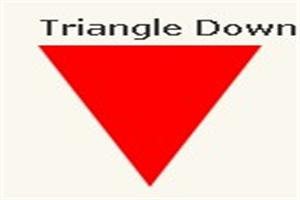

## Html/Css基础总结

***

常用的块状元素有：

`
、
、<h1>...<h6>、<ol>、<ul>、<dl>、<table>、<address>、<blockquote> 、<form>`

**特点：1.一个块级元素独占一行 2.元素的高度、宽度、行高以及顶和底边距都可设置 3.元素宽度在不设置的情况下，是它本身父容器的100%（和父元素的宽度一致**

常用的内联元素有：

`<a>、、 、<i>、<em>、<strong>、<label>、<q>、<var>、<cite>、<code>`

**特点：1.和其他元素都在一行上 2.元素的高度、宽度及顶部和底部边距不可设置 3.元素的宽度就是它包含的文字或图片的宽度，不可改变**

常用的内联块状元素有：

`、<input>`

**特点：1.和其他元素都在一行上 2.元素的高度、宽度、行高以及顶和底边距都可设置**

***

## HTML5 提供的新语义元素定义了网页的不同部分：

header：定义文档或节的页眉

nav	   ：定义导航链接的容器

section：定义文档中的节

article：定义独立的自包含文章

aside：定义内容之外的内容（比如侧栏）

footer：定义文档或节的页脚

details：定义额外的细节

summary：定义 details 元素的标题

***

## 零碎知识点记录

1.绝对定位的参照物可随意设置：参照元素加入position:relative;定位元素中加入position:absolute，便可以使用top、bottom、left、right来进行偏移定位，参照物就可以不是浏览器了。

2.css绘制三角形：

                          
#triangle-down {
    width: 0;
    height: 0;
    border-left: 50px solid transparent;
    border-right: 50px solid transparent;
    border-top: 100px solid red;
} 


3.占位符(placeholder)是用户在input框输入东西之前放置的预定义文本。语法如下：
`<input type="text" placeholder="this is placeholder text">`

4.给输入框添加required属性，这样用户不填写输入框就无法提交表单.语法如下：
`<input type="text" required>`

5.雪碧图

