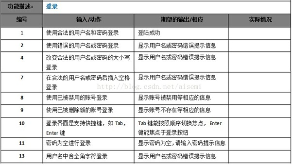
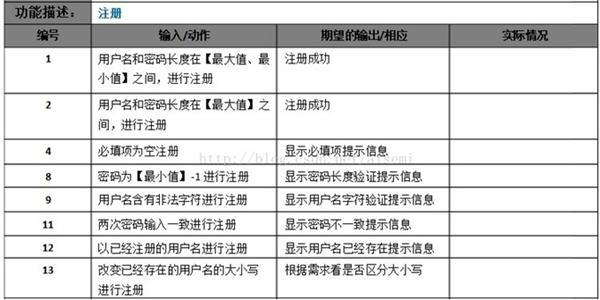

软件测试：使用人工或自动的手段来运行或测量软件系统的过程，以检验软件系统是否满足规定的要求，并找出与预期结果之间的差异。  

软件测试的五大要素：质量，人员，资源，流程，技术。

两个目标：提升测试覆盖率，提升测试效率。

软件测试的原则：

1.测试显示缺陷的存在，但不能证明系统不存在缺陷。

2.穷尽测试是不可能的，应设定及时终止的条件。

3.测试应该尽早进行。

4.缺陷具备集群特性。（测试bug多的模块，往往实际bug更多）

5.测试的杀虫剂悖论。（变更测试用例）

6.测试的二八原则。（测试时间资源有限，应该把80%时间放在20%的重要模块。）

7.测试活动依赖于测试背景。

##### 软件测试分类：

单元测试（针对代码的测试，对详细设计）：针对可分最小的单元测试（如一个Java程序中的类，APP中的登录功能）

集成测试（测试各个单元模块之间的接口，针对概要设计）：在单元测试的基础上，测试在将所有的软件单元按照概要设计，规格说明的要求组装成模块，子系统或系统的过程中各部分工作是否达到实现相应技术指标及要求的活动。（对已经完成测试的单元，测试模块和子系统）

系统测试：将经过集成测试的软件，作为计算机系统的一个部分，与系统中其它部分结合起来，在实际运行环境下对计算机系统进行的一系列有效的测试，以发现软件潜在的问题，保证系统的正常运行。（全面评估）

验收测试（交付测试）：针对用户需求，业务流程的正式的测试，确定系统是否满足验收标准，由用户，客户或其他授权及够决定是否接受系统。（针对用户）

##### 软件测试分类（测试手段）：

黑盒测试（用户视角）：把软件当做一个黑盒子。更多用在系统测试。

优点：容易实施，不需要关注内部的实现；更贴近用户的使用角度。

缺点：1.测试覆盖率较低，一般只能覆盖到代码量的不到40%。

2.针对黑盒的自动化测试，复用率低，维护成本高。

主要测试：1.是否有不正确或遗漏的功能？

2.在接口上，输入是否能正确的接受？能否输出正确的结果？

3.是否有数据结构错误或外部信息（例如数据文件）访问错误？

4.性能是否能够满足要求？

黑盒测试的主要设计方法：等价类划分法，边界值分析法，错误推测法，因果图法，正交测试分析法，状态迁移图法，流程分析法。

白盒测试（结构化测试）：语句，条件，条件组合，路径，分支

优点：1.迫使测试人员去仔细思考软件的的实现，理解原理。

      2.可以检测代码中的每条分支和路径

      3.揭示隐藏在代码中的错误

      4.对代码的测试比较彻底

缺点：1.昂贵（因为代码覆盖率要高）

      2.无法检测代码中遗漏的路径和数据敏感性错误

      3.（验证代码）不能直接验证需求的正确性

主要方法：代码检测法，静态结构分析法，静态质量度量法，逻辑覆盖法，基本路径测试法

灰盒测试（更多在系统组件）：介于黑，白盒测试之间的，关注输出对于输入的正确性，同时也关注内部表现。

静态测试：是指无须执行被测程序，而是通过评审软件文档或代码，度量程序静态复杂度，检查软件是否符合编程标准，借以发现编写的程序的不足之处，减少错误出现的概率。

动态测试：是指通过运行被测程序，检查运行结果与预期结果的差异，并分析运行效率，正确性和健壮性等。

手工测试：由专门的测试人员从用户视角来验证软件是否满足设计要求的行为。更适合针对深度的测试和强调主观判断的测试。（易发现缺陷，容易实施，创造性）（缺点：覆盖率难以量化，重复测试效率低，不一致性，可靠性低，人力资源依赖）

自动化测试：使用单独的测试工具软件控制测试的自动化执行以及对和预期结果进行自动检查。（优点：高效率，速度快，高复用性，覆盖率容易度量，准确可靠，不知疲劳）（缺点：机械，发现缺陷率低，一次性投入大）

##### 按测试模式来分类：

传统的瀑布模型：项目计划--需求分析--软件设计--程序开发--软件测试--集成维护

优点：强调需求设计的作用。前一阶段完成后，只需关注后续阶段。为项目提供了按阶段划分的检查点，里程碑清晰。文档规范。

缺点：难以适应需求的频繁变化。项目周期后段才能看到成果。强制的里程碑，完成时间点，变化能力差。文档工作量大。

V模型（使用最广泛，是瀑布模型的变动）

W模型（V模型的改进）：

X模型 H模型等。

敏捷测试：遵循敏捷宣言的一种测试实践。

敏捷宣言：个体与交互  重于  过程和工具
          可用的软件  重于  完备的文档
          客户协作    重于  合同谈判
          响应变化    重于  遵循计划

强调从客户角度进行测试

重点关注迭代测试新功能，不再强调测试阶段（单元，集成。。。）

尽早测试，不间断测试，具备测试条件即可

强调持续反馈

预防缺陷重于发现缺陷

基于脚本的测试-ST（script--testing）：系统性强；容易管理，控制；设计在先执行在后；主要是验证自己的思路；可预见性

探索式测试（ET）：完全抛开脚本代码的测试。自由灵活；和ST互补；执行和设计（思考）并行
优点：更能激发测试人员的创造性和工作乐趣

      增加了发现新的或较深入的bug的可能性

    在较短时间内找到更多bug对被测系统做出评估

    更加适用于敏捷项目

减少了在简单，繁复上用例的无谓编写时间

缺点：管理有局限性，较难协调和控制

      对bug的重复利用和重现上作用有限

      对测试人员的测试技能和业务知识深度依赖较大

      只有在SUT（被测系统 system under test）已完全的前提下才更有作用
      ET生产率很难定义，本身难进行自动化

局部ET从五大要素入手：输入，状态，代码路径，用户数据，执行环境

基于风险的测试-RBT（risk based testing）：一种基于对软件失效的风险评估并以此指导测试计划，设计，执行，结果评价的软件测试类型。

基于模型测试-MBT（model based testing）

##### 软件测试分类：

功能测试：根据产品特性，操作描述和用户方案，测试一个产品的特性和可操作性以确定他们满足设计需求。

针对的问题：功能错误或遗漏，界面错误，性能错误（处理性能），数据及访问性错误，初始化及终止错误。。

测试工具：	QTP winrunner，silk Test，rational robot，

性能测试：负载测试，压力测试，稳定性测试

性能指标：并发用户数VU；每秒事务数TPS；系统响应时间；设备性能

测试工具：LoadRunner，Silkperformer，Webload

静态性能评估：YSlow，PageSpeed

应用性能管理（APM）：提供对系统的实时监控以实现性能管理，故障管理的解决方案。

安全测试：对软件产品进行测试以确保其符合产品安全需求和质量标准

测试工具：Appscan，Nump，Webinspect

渗透测试：通过模拟对软件系统的恶意攻击行为来评估系统安全性的一种测试。

兼容性测试：软件本身的兼容（向后兼容，即与以前版本兼容）；不同平台下的兼容；软件对运行设备的兼容性；软件互操作性（与主流软件兼容，如和支付宝）
浏览器兼容性测试工具：BrowseShots

文档测试：针对软件产品的交付产品，配套的文档类部件的测试。如用户手册，使用说明，用户帮助文档。

文档测试关注要点：完整性，正确性，一致性，易理解性，易浏览性。

可靠性测试：软件可靠性，硬件可靠性（受气候环境，机械等影响）

易用性测试：指测试用户使用软件时是否感觉方便，是否保证用户使用体验的测试类型。

部署测试（安装测试）：第一个步骤，主要验证系统部署过程，并确保软件经过安装测试后可以正常使用。

主要测试内容：在不同环境下的部署验证；参照部署文档执行，过程的合理，正确性；准备软件环境的基础数据

记住sfdipot（举例微信app）

Structure（结构）：考虑其组成部分，微信朋友圈的代码组成，客户端是什么样的，服务端是怎样的。

Function（功能）：考虑单个功能是否符合预期。（比如显示一条别人发的朋友圈，又比如自己发一条朋友圈）

Data（数据）：考虑每个功能对应不同的数据。（比如发一条有文字有图片的朋友圈，发一条只有图片的朋友圈，显示十条新增的朋友等）

Interface（接口）：考虑各内部和外部接口。（比如朋友圈客户端和服务端的交互接口的功能。朋友圈和其它功能之间的接口，比如消息提示功能和朋友圈点赞功能的提示）

Platform（平台）：手机版，pad版，web版

Operation（用户操作场景）：测试用户常用场景。（用户打开微信看到十条消息提示，点击后进入朋友圈显示了别人的评论，用户对评论回复，并进入对方的朋友圈为其某条消息点赞。）

Time（时间）：速度，延迟。 

测试用例是一份描述具体测试步骤的文档，包括测试的输入参数、条件及配置、预期的输出结果等，用以判断被测软件的工作是否正常。

测试用例设计三大原则：

1.设计测试用例要力求最大的覆盖率，参考《需求规格说明书》对每个功能点进行操作上的细化，尽可能趋向最大需求覆盖率。

2.用例要对测试功能点、测试条件、测试步骤、输入值和预期结果准确描述。

3.在设计测试用例的时候，除了满足系统基本功能需求外，还应该考虑各种异常情况、边界情况和承受压力的能力等。

APP的安装、卸载测试

1.软件在不同操作系统及版本（Android的EMUI\Flyme\MIUI、iOS、WindowsPhone）下安装是否正常

2.软件安装后的是否能够正常运行，安装后的文件夹及文件是否写到了指定的目录里，安装后没有生成多余的目录结构和文件

3.软件安装过程是否可以取消

4.软件安装过程中意外情况的处理是否符合需求（如死机，重启，断电）

5.安装空间不足时是否有相应提示

6.对于需要通过网络验证之类的安装，在断网情况下尝试一下

7.重复安装应该有提示，

8.升级安装时，版本更新链接有效，比如后台设置的版本白名单

9.使用各种方式卸载程序，如直接删除安装文件夹卸载是否有提示信息、长按图标卸载、手机设置里卸载、第三方应用卸载

10.测试卸载后文件是否全部删除所有的安装文件夹

11.卸载过程中出现的意外情况的测试（如死机、断电、重启）

12.卸载是否支持取消功能，单击取消后软件卸载的情况

核对rp原型图和效果图，进行UI测试

.观察APP的用户界面(如菜单、对话框、窗口和其它可规控件)是否符合UI稿

.不同的连接页面之间导航链接是否有效，是否跳转是否正确。

.旋转手机，确保程序不退出，页面排版无异常。

.输入框说明文字的内容与产品需求一致

.某页无数据时、断网时、有网但接口异常时的状态页是否和UI一致

文档，进行功能测试

功能测试的用例要根据具体产品设计，这里只提供通用点。APP端测试最关心的是流程和数据，避免Crash和ANR（程序无响应）问题。

.App安装完成后是否能正常启动，且打开速度控制在预期时间内。

.切换后台再切换前台的操作对当前状态如登陆、当前页、数据刷新的影响

.强制杀掉APP进程再启动对当前状态如登陆、当前页、数据刷新的影响

.登陆验证/免密登陆时的手势密码和指纹是否符合产品需求

.对于有数据交换的页面，每个页面都必需要进行前后台切换、锁屏解锁的测试，这种页面最容易出现崩溃。

.同一用户在多个终端先后登陆时，APP是否有符合产品需求的处理

.App使用过程中有电话进来的中断测试，与文件下载、音乐播放、等应用的交叉情况测试。

.很多应用会支持缓存数据，测试在断网启动或从有网到无网时是否可以浏览缓存数据

安全性测试

a、软件权限 

扣费风险：包括短信、拨打电话、连接网络等。 

限制/允许使用手机拍照或录音

限制/允许使用手机读取用户数据，手机信息、联系人信息等

限制/允许使用手机写入用户数据 

没有用户的允许, 应用程序不能预先设定自动启动。

对App的输入有效性校验、认证、授权、数据加密等方面进行检测

没有用户的允许, 应用程序不能预先设定自动启动

手机能控制该APP能否使用Wi-Fi和移动数据

b、数据安全性 

如果数据库中重要的数据正要被重写，应及时告知用户。

在数据删除之前，应用程序应当通知用户或者应用程序提供一个“取消”命令的操作。 

对密码长度和复杂度的要求，

当将密码或其他的敏感数据输人到应用程序时, 其不会被储存在设备中, 同时密码也不会被解码。

当应用程序处理信用卡明细或其它的敏感数据时，不以明文形式将数据写到其他单独的文件或者临时文件中

性能压力测试

.APP端性能测试：在各种边界压力情况下，如电池、存储、网速等，验证App是否能正确响应

.Server端性能测试：通过测试接口的执行效率，如http接口

兼容性测试

.与本机已经安装的App是否兼容

.在各种系统、系统版本的不同手机上测试注册、登陆、修改密码等功能

.UI层的兼容，界面的显示根据不同尺寸手机是否自适应

.在各种系统、系统版本的不同手机上进行全方面的功能测试，如使用每一个iOS版本的iPhone上测试“我的银行卡”模块的提现功能。

.基于开发环境和生产环境的不同，检验在各种网络连接下(WiFi、2G/3G/4G等)，App的数据和运用是否正确

