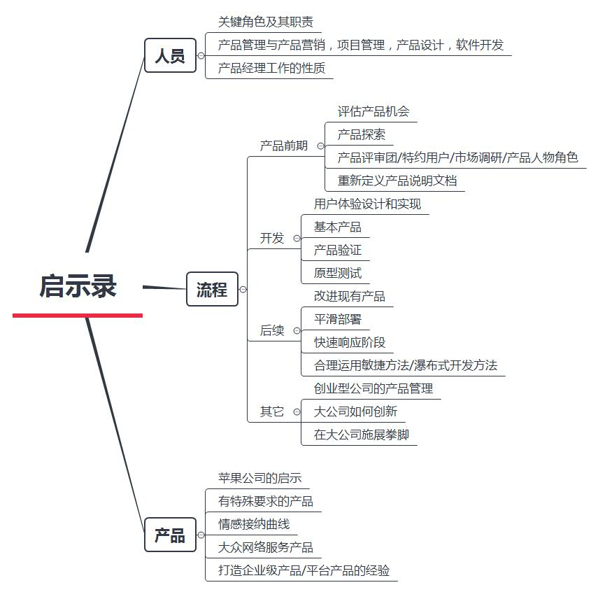

### 启示录框架

总结：看到时候解答和产品经理工作的许多疑惑，书里提供了许多新的思想，更适合入门级有实战经验的产品经理。所以现在这个阶段，看书的目的性不要太强，不要希望从书本得到很多，它可以带领我看清楚路，但要自己主动走。

### 用户体验要素框架

总结：这本书就是讲了一个，用户体验对产品是重要的，并且把它分成5个层面。记住和理解这5个层面的意义，看每款产品的角度变清晰了一点。入门选择的第一本书，理论比较多，以为自己看懂了但其实什么也不知道，所以类似的书要在项目中思考，结合才有体现。

### 结网框架

总结：书的内容更偏运营一点，把一个产品从概念的产生到具体实施，到后续的更新。说到了很多小的有用的技巧，下次看书要记得一边看一边留点笔记在纸上，不然看完了就看完了。

