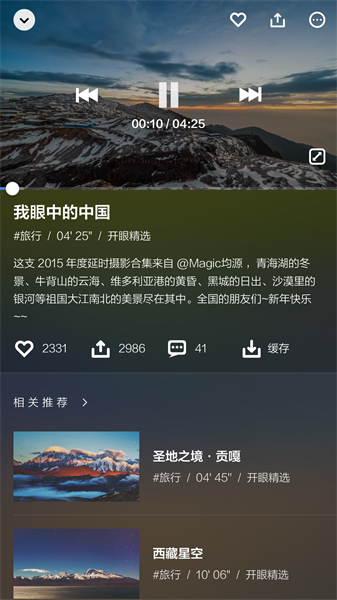

### 一.概述

##### 1.1体验环境

产品名称：开眼

产品版本：3.12.0

设备型号：iPhone6 plus

操作系统：iOS 11.03

体验时间：2017-11-09

##### 1.2产品概述

开眼是一个汇聚全球优质短视频的平台，每日精选5-10条极优质的高清短视频，给你视觉上的惊艳和了解世界的新方式。去帮用户更高密度地找到好内容，去满足用户更高层次的需求。

##### 1.3产品定位

轻量级的短视频推荐应用。

### 二.用户分析

消费者：以城市的年轻人为主，追求一些精致、新奇、有趣、能产生共鸣感的内容，能使他们稳定的碎片时间里能够有一个比较高质量的视觉消费的享受。

创作者：大部分为国内PGC供稿，能为他们提供更多的曝光。但对个人投稿不太友好，过程比较麻烦，且只能通过网页端投稿。

### 三.市场现状及分析

2016年，2017年视频领域爆发式发展，美拍，抖音，快手等视频平台的爆发，直播和短视频这些形式的各方实践，都展示了视频领域的活力和巨大市场。但存在一些问题，一方面是新兴视频的内容更偏向于娱乐和大众消费，因此用户群体有一定局限性；另一方面是短视频自媒体的快速发展，这些优质内容却分散在不同的网站和公众号。开眼抓住机会，很好地解决了用户痛点，所以在大批量的视频平台中留住了不少用户。

### 四.盈利模式

在使用过程中，开眼没有任何直白的硬广推荐，非常看重用户体验。其盈利依靠在视频中植入软广，在未来可能是作为视频平台与更多国内PGC进行版权合作。

### 产品结构图

##### 4.2交互体验

整天软件使用做到了流畅自然，tab标签交互框架入口清晰，视频的瀑布流展示高效易浏览。播放视频界面快进，快退，音量的增减都可以进行手势滑动操作，体验友好。

亮点：1.视频详情页，沉浸式处理，让用户专注在视频体验上。
2.视频详情页，下拉手势操作就可退回，操作轻便。

##### 4.3视觉体验

1.视觉一致性做的很好，整体上视觉效果品质感强，风格潮流简洁。

2.图片都采用了画报风格的卡片式设计，和一般视频应用相比，界面更有序整洁，颜值高。

3.每次打开“开眼”会有一张高清图片，配上开眼的logo和口号，集聚视觉冲击力，和开眼整体的设计风格统一。

4.在视频详情页，点击会视频一定的模糊，弹出高亮的操作框，画面很和谐。

##### 4.4主要界面体验

主页：每天更新有趣，特别的短视频。视频的推送很有吸引力，契合了开眼新奇，大开眼界的定位。以瀑布流的方式呈现，直接简便。但主页的不能个性化推送，导致很多的视频并不合用户胃口。

发现：是一个对视频的汇总，有分类，排行榜，热门作者，专题等等。而且所有能看到的图片都经过统一化处理，保持着简洁，有逼格的风格统一。但单独要找到某个视频却不方便，因为关键字搜索会把所有结果展现给你，不能进一步自定义筛选，所以看视频更趋向一种随机性。

##### 4.5功能分析

发现视频，视频操作

由开眼对视频的可操作性来看，产品架构清晰，功能适中。通过流程图来看，开眼重心在对视频的观看，发现，分享上，用户发表评论，寻求社交的途径是边缘化的。不过根据版本迭代的功能来看，开眼开始重视并发掘UGC 这一块，以及个性化推荐上。

### 6.建议

优点：1.和大部分直播应用相比，开眼UI设计做得很出色，每个页面的风格浓郁，整洁。

2.在短视频市场找到了自身定位，产品有自己的风格特色。

缺点：对长久使用的用户来说，推荐内容重复，视频的新鲜感在降低。也因为产品定位在新奇有趣，所以有时候视频不接地气，走向无聊。

### 7.总结

因为开眼在新兴的短视频市场中发现了用户痛点，找准定位，使得他得到了大批用户。但其软件定位的原因是优势也是劣势，一方面吸引了追求视频品质的用户，让它在市场中坚定地站住了脚；另一方面因为视频内容的不接地气，遥远，使得用户虽然喜欢，看好，但更是一种自我的使用，没有流行的，潮流的内容刺激用户分享，提高热度。注定了开眼的用户增长只能是缓慢的。

