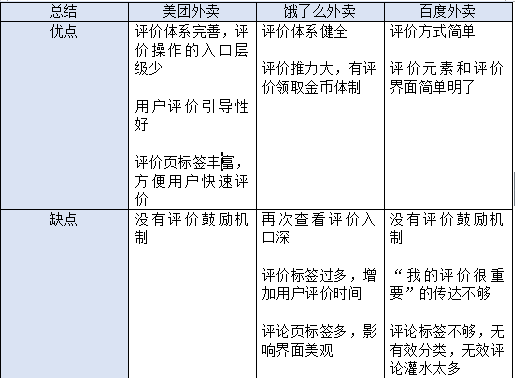

### 作为产品经理，竞品分析是一项基本能力。请对比百度外卖、美团外卖、饿了么的评价功能，做一次竞品分析，说出优势和劣势。

评价在外卖平台中是用户参考的一项重要指标，能直接影响用户购买决策，与商家在平台的销售量关联，一个公正客观的评价体系对商家具有监管作用，提升服务质量，形成产品的良性循环。以下从评价功能逻辑，和评价的内容对比。

1.评价功能逻辑对比

三个平台都在用户确认订单后立即评价，不做比较。比较1.用户初次评价后查看评价 2.用户没有立即评价，后续来评价 3.评价驱动力

1.美团外卖初次评价后，显示订单已完成。查看入口在我的--我的评价。饿了么初次评价后，显示订单已完成，再次查看入口层级深，订单--订单详情--我的评价。百度外卖初次评价后，订单有查看评价标签，我的--我的订单可再次查看。
2.用户初次没有评价时，美团订单页--待评价子页有明显数字标识。饿了么的订单--立即评价，有评价拿金币的明显按钮。百度订单页--去评价。
3.用户的评价驱动力有3点，服务和商品的极端化（体验很好或很差），平台鼓励机制，平台向用户暗示评价很重要。美团有单独的待评价页，我的评价中可以对历史评价分享，追评和删除，对评论的多操作性和功能入口简单，让用户更愿意写评价。饿了么对评价给予金币奖励，可以用来兑换购物券和抽奖，在外卖平台是有效的鼓励。百度外面没有鼓励机制，评价重要性的传达也做得不够。

2.内容对比

美团外卖：购买标签中，美团外卖的五角星评价没有指数，参考意义不大。亮点：店铺评论详情页分了全部、有图、点评三个标签，方便快速查看。单条评论内容简洁。 缺点：点评页是被盖章优质点评的评论，但9999+的评论数量只有7条优质评论，且时间跨度最少的也有2个月，更新得不够及时。
评分内容：口味，包装，配送，固定标签，文字+图片。

饿了么：缺点：店铺购买页中，评价标题无数量标识。单条评论中，满意度表情，购买物品，文字分别使用了4种颜色，使得评论内容纷杂。优点：评论可以互相回复。综合评分有高于周边商家的百分比显示。

百度外卖：优点：界面简洁，评价内容少。缺点：评论数量普遍较少，分类标签少，查看不便捷。

### 请预估在正常星期五的下午14:30分，有多少用户在刷新朋友圈？请重点描述你的理由以及推理过程

不知道怎么回答。多少用户是哪里的用户，武汉的？全国的？我朋友圈的？

运营的二八法则，20%的活跃用户贡献80%的内容，剩余80%的用户贡献了20%的内容。

这种题目被称之为“费米问题”。这种问题的核心就是进行通过科学的假设对于一个信息量有限的问题进行合理估算。网上有很多这样子的题目，比如“全世界需要多少调音师”，比如“北京市需要多少厕所。”回答这种问题的关键不在于你回答任何数字，回答任何数字都是错误的，需要回答的应该是你合理的估算解决问题的关键路径步骤，只要这个是没有问题的，那么再扯的数字都是正确的。

