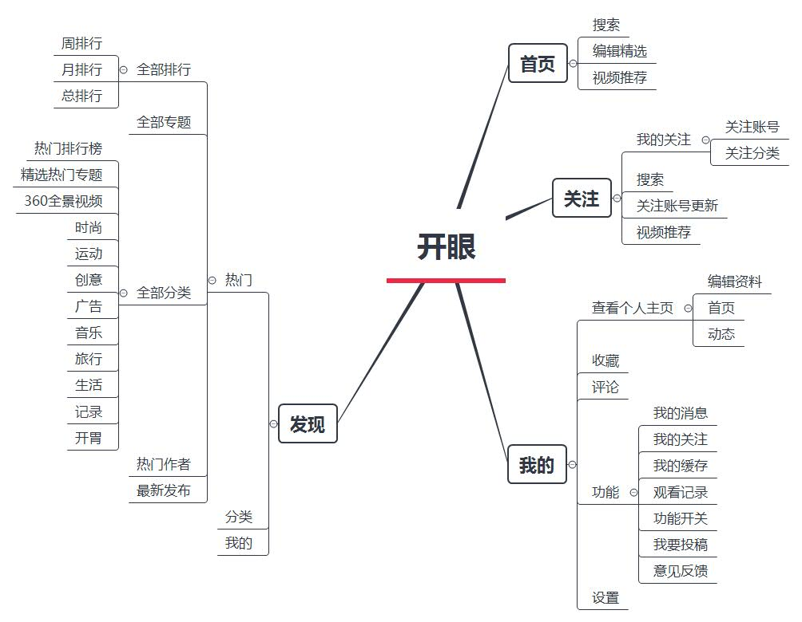
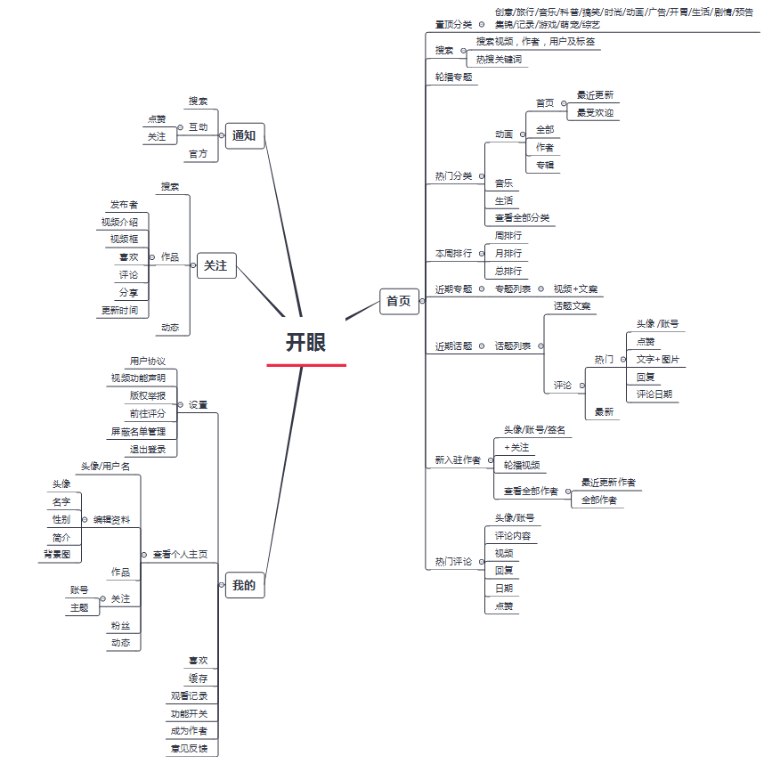
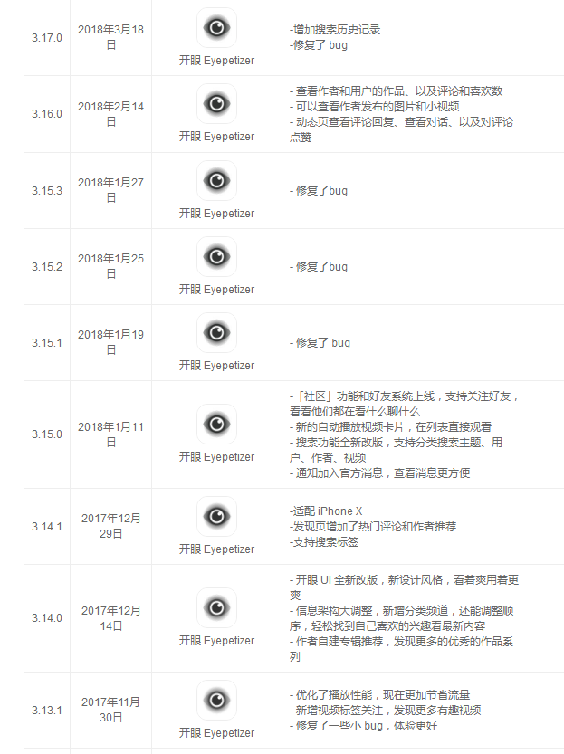
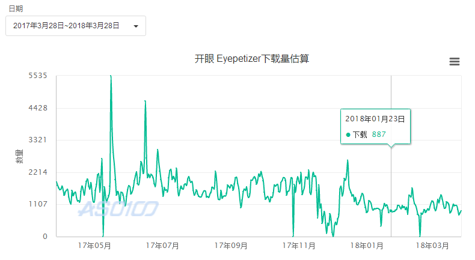

本文从产品结构，功能变动，变动结果，优化建议，未来预测，

产品名称：开眼

产品版本：3.17.0

设备：iPhone 6s plus

系统：iOS11.1.2

平均日下载量：1200

娱乐榜排名：200左右

### 开眼功能结构图对比

由图看出，开眼的信息架构做了较大的调整，主要有：

1.取消'发现'，新增“通知”。

2.“发现”页内容迁移至“首页”，视频展示由原瀑布流转变成标签跳转子页面。

3.内容上，新增“话题”，“新入驻作者”，“热门评论”

4.'搜索'增加热搜关键词，搜索结果由原“视频列表”转变为“作者+用户+视频”。

5.入驻作者可以建立专辑，登录开眼PC端能看见详细数据。

6.新增视频标签关注

### 版本记录分析

有图看出，自3.12版本以来，开眼有过两次大的改版，一次是3.14版，UI全新改版，做了较大的改动；一次是3.15版，增加“社区”功能，支持关注好友。每次改版除了不断优化播放性能，还一步步地往社区上靠，“通知”页像用户官方推荐话题互动，在首页增加“热评”，和热门作者。

但根据市场反馈来看，两次重大改版后不但没有用户激增，反倒下载量和排名都有下降趋势。

### 市场现状分析

视频领域早已是红海，开眼前期之所以能发展，一是独特的视频调性，出色的内容运营，二是恰逢自媒体蓬勃发展，开眼聚合这些优质视频，留住了用户，三是快手，美拍，秒拍等视频内容偏向于娱乐，用户群体的局限性。

但2017年短视频成为风口 ，抖音等APP的出现，前后又有直播答题等热点，吸走了大部分流量。开眼在12月份改版往社区上发展，企图提升用户的社交参与，留住用户，但反响都不乐观。社区低迷的原因有以下：

1.和开眼的产品定位有关，视频内容更精致，文雅，层次更深意一点。难以有爆点，能刺激用户传播分享，所以一直不温不火。

2.社区用户基础不够，由二八原则来看，开眼大部分用户都是普通用户，只是看看视频，偶尔发表评论，加上视频资源庞大，更加稀释了社区氛围。

3.用户分享机制的改变。原来是老用户看到好视频--分享冲动--分享到圈子--心里得到满足--沉浸产品--更活跃，而现在用户在朋友圈更加克制，鸡汤，哲学之类的东西变少，所以用户的分享冲动减少，便难以有新用户转化进来。

### 优化建议

1.把“通知”融入到“我的”，新增一个模块分担“首页”内容。

开眼首页承载的内容过多，四个模块中，“关注”通知”我的”过于冷清，严重失衡。如果我是产品经理，会考虑把“通知”融入到“我的”，同时新增一个模块来分担“首页”内容。

“通知”下的层级为“互动”和“官方”。”关注“下的层级为”作品“和”动态“。在个人主页里也存在”动态“。在实际使用中，互动和动态界限不明显，虽然承担着社交的任务，但在开眼如今社区氛围一般的情况下，可以考虑合并。开眼通过”官方“给用户推送话题，吸引用户讨论，但话题却只在”首页“的发现中占了很小的展示面积，入口层级深，这是不太合理的。

2.话题和热门评论可以从首页的视频瀑布流分离出来，承担社区化任务。

原因是这两个模块是文字内容，而“主页”是视频区，两种形式挤在一起，一会分散用户在视频上的注意力，二作为社交化的触手，藏在“首页”入口太深。

### 未来预测

