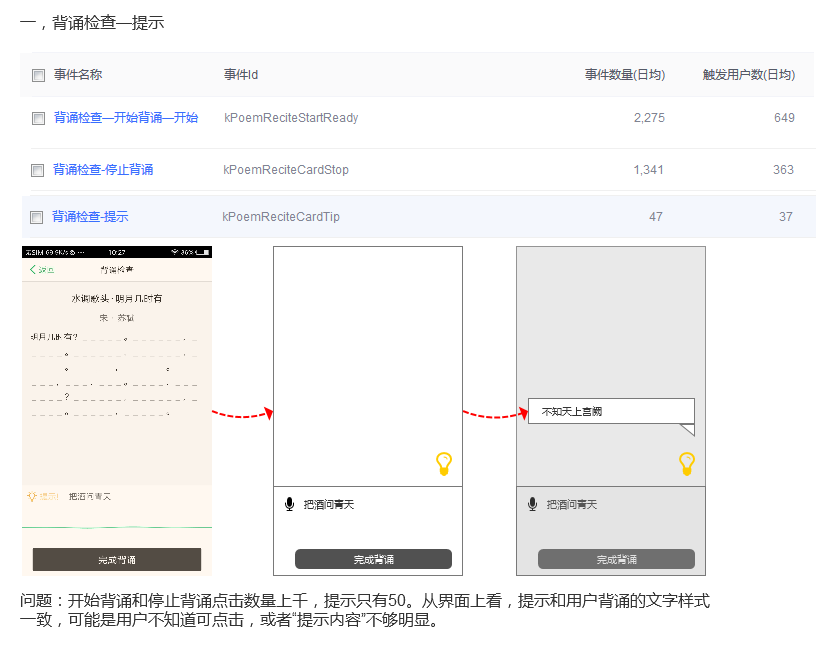
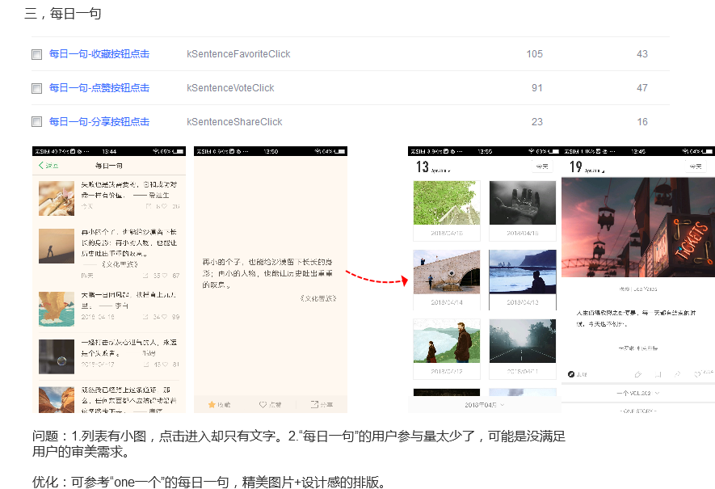
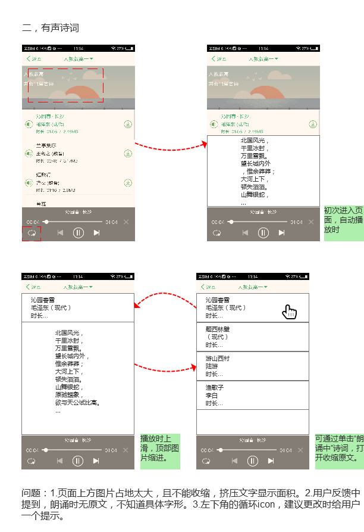
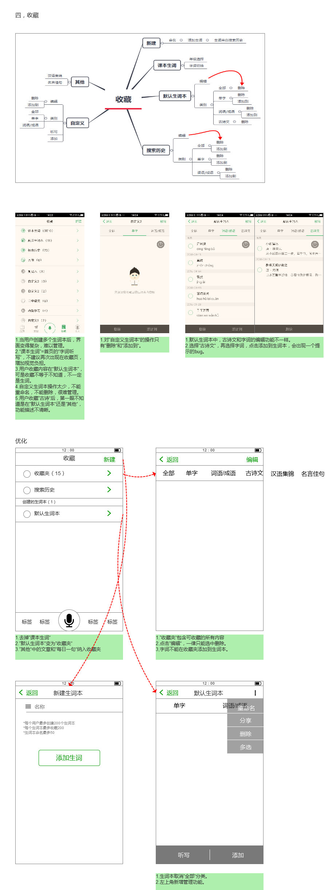
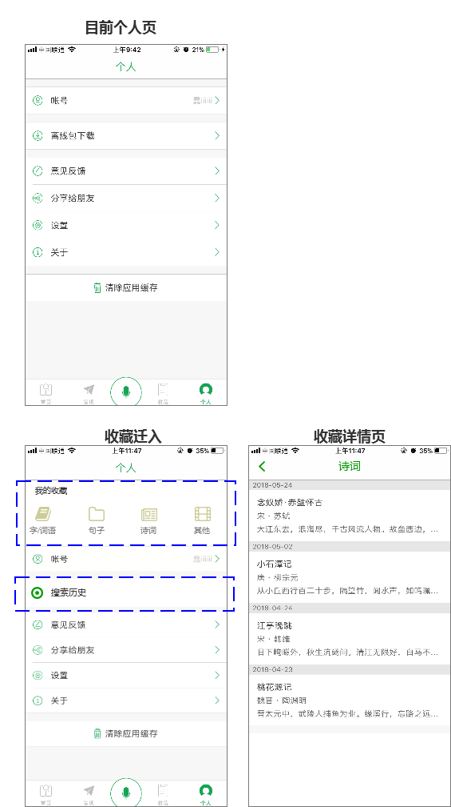

### 背诵检查--提示按钮优化 

在2.5版中，背诵检查的提示和用户背诵内容在同一个显示窗，且提示按钮位置不太合理。我做的优化是把提示和用户背诵分离，这样逻辑才合理，在2.5.2版优化上线后，触发人数和事件数量并无明显变化。

我的思考是：这一类细微的体验优化，对用户而言可能都不会注意到，最多是使用中感觉有不一样，普通用户具体也感知不出来。所以虽然用户体验很重要，但真实情况还是核心功能上是否满足需求，就这个背诵检查来说：可能是核心功能检查满足得就不好，更多用户是体验后就走，于是这样的细枝末节就不在意。

作为产品，我对交互和用户体验的细节很敏感，很爱那些逼格高，交互极流畅的app。但一个产品，无论是app还是某个功能模块，都要能解决用户实际需求，如果需求得不到解决，便没有使用场景，继而会被用户卸载。就比如背诵检查这一模块，主要还是在语音识别的准确度，像“提示”位置和交互这样的小点，只有普通用户成为深度用户，才会有察觉。（当然，这一版出于工作量的考量，只对此功能做了小优化）

**在用户体验优化上，核心功能>死抠细节**

### 每日一句的排版优化

虽然至今每日一句的新设计已经出了，但需求排期还在很后面，每一版的工作量都在那些收益明显或问题明显的功能上，类似这种rd眼中没有意义的优化点有很多，但对数据不会产生明显影响，甚至可以说是产品直观上的改进体验，不容易推动。
像这种细节优化，产品可以锱铢必较，但重要的是决定什么时候做，判断哪些问题可以搁置，哪些明显降低用户体验。同时也要判断产品现状和人力，像目前我所在的团队，处在寻求新的用户突破的节点，所以这些细节问题，在每一版开发中，自己小小地去推进。

这是面对相同问题，纯银V的博客：[https://www.jianshu.com/p/70e504a21431](https://www.jianshu.com/p/70e504a21431)

### 有声诗词增加原文

一些小优化：比如切换循环态的提示、顶部图片支持收缩是明显而且必要的。但增加原文的这种方式没有通过评审，PM指出的问题是：增加原文页是希望用户在听的同时也能看，古诗词这种音频不像歌曲，很多句子不看原文就不知道念的是什么，所以原文是要增加。但用户在进入有声诗词后，主要需求还是听，所以听的操作一定是最方便，权重最高。

这里犯了一个错误，就是没有考虑用户需求的主次，听和看都是真实需求，但进入有声诗词来的主要是听。所以这次设计虽然操作逻辑上没有问题，但却不合理。

### 生词本整体优化

图上的问题都是实在问题，但优化方案却并没有更好一点。PM给的建议是：列出用户收藏涉及的每一步操作，然后去看每一步逻辑是否合理，用户在任何一步是否都能前进后退。

现在发现自己有个问题：设计方案总禁锢在app现有模式里，觉着尽量少的动页面，不敢创新。因此所有方案的出发点都是优化，而不是思考用户需求，做出合理优化。原因一是不知道页面改动的工作量，不能判断；二是不敢犯错，在原有基础上优化，大概率是对的。

这是后来2.7版通过评审的设计方案，与app后面的方向有关

