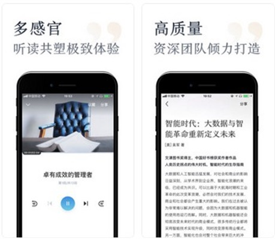

### 一、APP截图

### 二、体验理由

移动阅读无论是个性化还是电子书，同类产品几乎已经占据大部分市场份额，但这款app还是找到了切入点，就是知识焦虑。现在很多朋友圈爆文就是在贩卖焦虑，加上互联网时代信息爆炸，这种焦虑急剧加深并扩散。但在18年进入阅读市场，app需要细分用户、细分场景才能占得一席之地。

### 三、APP功能

slogan：一刻钟读世界万千，提倡高效知识学习平台

主要功能：书籍推荐搜索、看书、听书

书籍性质：1.类别定位很明确，职场、心理学、商业、历史等知识属性强，趣味性少的 2.每本书的内容都不是原文，提炼过的中心思想，或者书评

### 四、亮点

1.在每本书的前置页，告诉你将掌握哪些精华，适合阅读人群

2.以便签的形式展现作者介绍，书评，书摘等

3.在书籍章节间隔弹出原著金句、精华内容

### 五、槽点

#### 大方向上

1.书的内容非常有限，音频和文本都是pgc，虽然质量很高，但产出速度有限，目前每周上新不到20本，书库资源匮乏，将留存很低

2.不能点赞、评分、评论，0社交，用户出于隔绝状态。书单和推荐全靠官方运营推荐

（为什么0社交？我觉得1、因为文章本来就是总结和主旨提炼，用户基本没看过原著，所以见解很少，表达的欲望也少，2、可能1.0版不是合适时机，用户量和书籍资源都处在冷启动阶段，后期可能考虑点赞数和分享数，也可能会出现订阅号，或者入驻作者

3.作为学习平台，涉及学习的功能少而单薄，如果不能持续给用户信心或督促，用户不容易感知到进步或成就感，即没解决知识焦虑，用户就会离开。

#### 功能细节上

1.由于书籍资源少，搜索无结果的概率很大，同时因为书籍问题，搜索的人数很多，目前搜索无结果页没有任何操作及信息。未来优化可以提供反馈入口，并给出书籍推荐等 

### 六、用户

用户群：男生是女生3倍，地点主要是北京，广州

用户特征：受教育程度高，有一定消费潜力，对质量要求高，集中在大学到工作几年后阶段，知识焦虑高峰。根据艾瑞报告，阅读场景多在工作、学习空闲时间，睡前

#### 七、新的使用场景

满足用户发现好书这个需求，目前所有用户是隔绝的。目前用户发现想读的书，只有口碑传播，豆瓣上找，或者阅读app上的推荐，但很多书很冷门，ugc的评分和评论很少，失去参考价值，而且读一本书的成本很高，不轻易尝试，所以冷门的书很冷门。其实是一个豆瓣电影的场景

